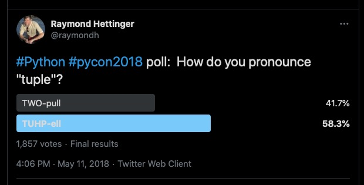

# Python Collections

Dr. David Greenwood

david.greenwood@uea.ac.uk

Room SCI 2.16a

---

## Resources

- https://docs.python.org/ 

- https://www.w3schools.com/python/


Note: Take care with online resources, that they are uo to date and accurate

---

## Contents

- Tuples, Lists, Sets and Dictionaries
- Reading from and writing to collections
- Comprehensions
- Methods on collections

---

# Tuples

A tuple is a collection which is 
<span id="bright">**ordered**</span> and
<span id="bright">**immutable**</span>.
<!-- .element: class="fragment" -->

--



--

Tuples are used to store multiple items in a single variable.

Tuples are written with parentheses 
<span id="bright">(</span>round brackets<span id="bright">)</span>.
<!-- .element: class="fragment" -->

--

```python
fruits = ("apple", "banana", "cherry")
```

--

Tuple items are ordered, unchangeable, and allow duplicate values

--

We access items by indexing

```python
print(fruits[0])
```
<!-- .element: class="fragment" -->

```text
apple
```
<!-- .element: class="fragment" -->

Note:
We will dive deeper into indexing with `lists`

--

Because tuples are immutable, we can't change items.

```python
fruits = ("apple", "banana", "cherry")

fruits[0] = "orange"
```

```text
TypeError: 'tuple' object does not support item assignment
```
<!-- .element: class="fragment" -->

--

Tuples can have multiple items with the same value.

```python
fruits = ("apple", "banana", "cherry", "apple", "banana")
```
<!-- .element: class="fragment" -->

--

To determine how many items a tuple has, use the `len()` function

```python
fruits = ("apple", "banana", "cherry")
print(len(fruits))
```
<!-- .element: class="fragment" -->

--

For a tuple with only one item, you must use a trailing comma.

```python
fruits = ("apple",)
```
<!-- .element: class="fragment" -->

--

# Why?

Without the comma, Python treats the contents of parentheses as an expression
<!-- .element: class="fragment" -->

--

## Data types

Tuple items can be of any data type.
<!-- .element: class="fragment" -->

--

```python
fruits = ("apple", "banana", "cherry")
numbers = (1, 5, 7, 9, 3)
answers = (True, False, False)
```

--

Tuple items can be of mixed data type.

```python
mixed_types = ("apple", 1, True)
```
<!-- .element: class="fragment" -->

--

## Tuple unpacking

extract tuple items back into variables
<!-- .element: class="fragment" -->

--

```python
fruits = ("apple", "banana", "cherry")
a, b, c = fruits

print(a)
```

```text
apple
```
<!-- .element: class="fragment" -->

--

## FYI

When a function returns multiple values, it returns a tuple. 

---

# Lists

A list is a collection which is 
<span id="bright">**ordered**</span> and
<span id="bright">**mutable**</span>.
<!-- .element: class="fragment" -->

--

Lists are used to store multiple items in a single variable.

Lists are written with 
<span id="bright">[</span> square <span id="bright">]</span> brackets.
<!-- .element: class="fragment" -->

--

```python
fruits = ["apple", "banana", "cherry"]
```

--

### lists are ordered

we access items by indexing

```python
print(fruits[0])
```
<!-- .element: class="fragment" -->

```text
apple
```
<!-- .element: class="fragment" -->

--

### lists *are* mutable 
### we *can* change items

```python
fruits = ["apple", "banana", "cherry"]
fruits[0] = "orange"

print(fruits)
```

```text
['orange', 'banana', 'cherry']
```
<!-- .element: class="fragment" -->

--

## Data types

List items can be of any data type.
<!-- .element: class="fragment" -->

--

```python
fruits = ["apple", "banana", "cherry"]
numbers = [1, 5, 7, 9, 3]
answers = [True, False, False]
```

--

List items can be of mixed data type.

```python
mixed_types = ["apple", 1, True]
```
<!-- .element: class="fragment" -->

---

# Indexing

--

## Reminder

```python
fruits = ["apple", "banana", "cherry"]
print(fruits[1])
```

```text
banana
```
<!-- .element: class="fragment" -->

Note: Why is it banana?

--

### Errors

```python
letters = ["a", "b", "c"]
print(letters[3])
```

```text
IndexError: list index out of range
```
<!-- .element: class="fragment" -->

--

### Negative Indexing

We can index from the end of the list!

-1 is the last item, -2 is next to last item...
<!-- .element: class="fragment" -->

--

```python
fruits = ["apple", "banana", "cherry"]
print(fruits[-1])
```

```text
cherry
```
<!-- .element: class="fragment" -->

--

### Range of Indices

The `:` operator allows a range of indices.

Note: You can specify a range of indexes by specifying 
where to start and where to end the range.

--

```python
letters = ["a", "b", "c", "d", "e", "f", "g"]
print(letters[2:5])
```

```text
['c', 'd', 'e']
```
<!-- .element: class="fragment" -->

--

### defaults

- default start is 0
- default end is `len()` of collection
- default interval (step) is 1
- range is start to end -1

--

#### example 

```python
letters = ["a", "b", "c"]
print(letters[:2])
```

```text
['a', 'b']
```
<!-- .element: class="fragment" -->

--

#### example 

```python
letters = ["a", "b", "c"]
print(letters[1:])
```

```text
['b', 'c']
```
<!-- .element: class="fragment" -->

--

#### example 

```python
letters = ["a", "b", "c"]
print(letters[::-1])
```

```text
['c', 'b', 'a']
```
<!-- .element: class="fragment" -->

---

# Iterables

Python collections are <span id="bright">`iterable`</span> 

We can use a <span id="bright">`for`</span> loop to access items
<!-- .element: class="fragment" -->

--

```python
letters = ["a", "b", "c", "d", "e", "f", "g"]

for letter in letters:
    print(letter, end=" ")
```

```text
a b c d e f g
```
<!-- .element: class="fragment" -->

--

### enumerate

```python
letters = ["a", "b", "c", "d"]
fruits = ["apple", "banana", "cherry", "orange"]

for i, letter in enumerate(letters):
    print(letter, fruits[i], end=" ")
```

```text
a apple b banana c cherry d orange
```
<!-- .element: class="fragment" -->

--

### zip

```python
letters = ["a", "b", "c", "d"]
fruits = ["apple", "banana", "cherry", "orange"]

for letter, fruit in zip(letters, fruits):
    print(letter, fruit, end=" ")
```

```text
a apple b banana c cherry d orange
```
<!-- .element: class="fragment" -->

--

### avoid

```python
for i in range(len(fruits)):
    ...
```

---

# List Comprehensions

Comprehensions are a 'pythonic' way of composing a collection.
<!-- .element: class="fragment" -->

Note: Usually, we want to perform some action on each item of an iterable, 
and store the result as one variable.

--

### Example - list comprehensions

```python
squared = [x**2 for x in range(1, 5)]
print(squared)
```

```text
[1, 4, 9, 16]
```
<!-- .element: class="fragment" -->

--

### Example - conditional

```python
squared_even = [x**2 for x in range(1, 9) if x % 2 == 0]
print(squared_even)
```

```text
[4, 16, 32, 64]
```
<!-- .element: class="fragment" -->

--

### Example - nested

```python
numbers = [1, 2]
letters = ["a", "b"]
nested = [(i, j) for i in numbers for j in letters]

print(nested)
```

```text
[(1, 'a'), (1, 'b'), (2, 'a'), (2, 'b')]
```
<!-- .element: class="fragment" -->

--

## Equivalent

```python
numbers = [1, 2]
letters = ["a", "b"]
nested = []

for i in numbers:
    for j in letters:
        nested.append((i, j)) 

print(nested)
```

```text
[(1, 'a'), (1, 'b'), (2, 'a'), (2, 'b')]
```
<!-- .element: class="fragment" -->

---

## List Functions

--

To add an item to the end of the list, use the `append()` method


```python
fruits = ["apple", "banana", "cherry"]
fruits.append("orange")

print(fruits)
```

```text
['apple', 'banana', 'cherry', 'orange']
```
<!-- .element: class="fragment" -->

--

To insert a list item at a specified index, use the `insert()` method


```python
fruits = ["apple", "banana", "cherry"]
fruits.insert(1, "orange")

print(fruits)
```

```text
['apple', 'orange', 'banana', 'cherry']
```
<!-- .element: class="fragment" -->

--

To append elements from *another* list to the current list, 
use the `extend()` method


```python
fruits = ["apple", "banana", "cherry"]
tropical = ["mango", "pineapple", "papaya"]
fruits.extend(tropical)

print(fruits)
```

```text
['apple', 'banana', 'cherry', 'mango', 'pineapple', 'papaya']
```
<!-- .element: class="fragment" -->

--

We can also use the `+` operator to join lists

```python
fruits = ["apple", "banana", "cherry"]
tropical = ["mango", "pineapple", "papaya"]
tutti_frutti = fruits + tropical

print(tutti_frutti)
```

```text
['apple', 'banana', 'cherry', 'mango', 'pineapple', 'papaya']
```
<!-- .element: class="fragment" -->

--

The `pop()` method removes the specified index


```python
fruits = ["apple", "banana", "cherry"]
fruits.pop(1)

print(fruits)
```

```text
['apple', 'cherry']
```
<!-- .element: class="fragment" -->

--

If you do not specify the index, the `pop()` method removes the last item.

```python
fruits = ["apple", "banana", "cherry"]
fruits.pop()

print(fruits)
```

```text
['apple', 'banana']
```
<!-- .element: class="fragment" -->

--

## FYI

Using the `append()` and `pop()` methods, Python lists work as a
<span id="bright">stack</span> data structure.

Last In First Out <span id="bright"> LIFO </span>
<!-- .element: class="fragment" -->


--

List objects have a `sort()` method.

```python
fruits = ["orange", "mango", "kiwi", "pineapple", "banana"]
fruits.sort()

print(fruits)
```

```text
['banana', 'kiwi', 'mango', 'orange', 'pineapple']
```
<!-- .element: class="fragment" -->

--

## FYI

The `sort()` method works in place - unlike the `sorted()` function
we looked at last week.

---

# Sets

A set is a collection which is 
<span id="bright">**unordered**</span> and has
<span id="bright">**immutable**</span> items.
<!-- .element: class="fragment" -->

--

Sets are used to store multiple items in a single variable.

Sets are written with braces 
<span id="bright">{</span>curly 
brackets<span id="bright">}</span>.
<!-- .element: class="fragment" -->

--

```python
fruits = {"apple", "banana", "cherry"}
```

--

- Set items are unordered, unchangeable. 
- Sets **do not** allow duplicate values.
- Sets **can** be modified as a whole.

--

### Items must be immutable

```python
fruits = {"apple", "banana", ["mango", "pineapple"]}
```

```text
TypeError: unhashable type: 'list'
```
<!-- .element: class="fragment" -->

--

### Access Items

No indexing, but you can use a `for` loop, or the `in` keyword.

```python
fruits = {"apple", "banana", "cherry"}
print("cherry" in fruits)
```

```text
True
```
<!-- .element: class="fragment" -->

--

### Add items

```python
fruits = {"apple", "banana", "cherry"}
fruits.add("orange")

print(fruits)
```

```text
{'cherry', 'banana', 'apple', 'orange'}
```
<!-- .element: class="fragment" -->

--

### Add any iterable

```python
fruits = {"apple", "banana", "cherry"}
tropical = ["pineapple", "mango"]
fruits.update(tropical)

print(fruits)
```

```text
{'mango', 'pineapple', 'banana', 'cherry', 'apple'}
```
<!-- .element: class="fragment" -->

--

### Set operations

```python
fruits = {"apple", "banana", "cherry"}
tropical = {"pineapple", "mango"}

print(fruits.union(tropical))
```

```text
{'mango', 'pineapple', 'banana', 'cherry', 'apple'}
```
<!-- .element: class="fragment" -->

```python
print(fruits | tropical)
```
<!-- .element: class="fragment" -->

```text
{'mango', 'pineapple', 'banana', 'cherry', 'apple'}
```
<!-- .element: class="fragment" -->

--

### Consult the documents for full details of available methods

--

### Set Comprehensions

Set comprehensions are also supported.

```python
a = {x for x in 'abracadabra' if x not in 'abc'}
print(a)
```

```text
{'r', 'd'}
```
<!-- .element: class="fragment" -->

---

# Dictionaries

A `dictionary` is a collection which is 
<span id="bright">**ordered**</span>, is
<span id="bright">**mutable**</span> and
does not allow duplicate keys.
<!-- .element: class="fragment" -->

"ordered" means the items order is guaranteed, it does **not** mean we access items with indexing
<!-- .element: class="fragment" -->

--

Dictionaries are used to store data values in key:value pairs in a single variable.

Dictionaries are written with braces 
<span id="bright">{</span>curly 
brackets<span id="bright">}</span>.
<!-- .element: class="fragment" -->

--

```python
car = {
  "brand": "Ford",
  "model": "Mustang",
  "year": 1964
}
```

--

Dictionaries **do not** allow duplicate keys.

```python
car = {
  "brand": "Ford",
  "model": "Mustang",
  "year": 1964,
  "year": 2020
}

print(car)
```

```text
{'brand': 'Ford', 'model': 'Mustang', 'year': 2020}
```
<!-- .element: class="fragment" -->

--

Dictionary values can be referred to using the key.

```python
car = {
  "brand": "Ford",
  "model": "Mustang",
  "year": 1964
}

print(car["brand"])
```

```text
Ford
```
<!-- .element: class="fragment" -->

--

We can access values with the `get()` function, which can return a default.

```python
car = {
  "brand": "Ford",
  "model": "Mustang",
  "year": 1964
}

print(car.get("colour", "black"))
```

```text
black
```
<!-- .element: class="fragment" -->

Without a default value, `get()` returns `None`.
<!-- .element: class="fragment" -->

--

Dictionaries are `iterable`

```python
for key in car:
    print(key, end=" ")
```

```text
brand model year
```
<!-- .element: class="fragment" -->

--

Iterate over values with the `values()` method

```python
for value in car.values():
    print(value, end=" ")
```

```text
Ford Mustang 2020 
```
<!-- .element: class="fragment" -->

--

Iterate over key and value with `items()` method

```python
for key, value in car.items():
    print(key, value, end=" ")
```

```text
brand Ford model Mustang year 2020 
```
<!-- .element: class="fragment" -->

--

### Dictionary Comprehensions

Dictionary comprehensions are also supported.

```python
a = {x: x**2 for x in (2, 4, 6)}
print(a)
```

```text
{2: 4, 4: 16, 6: 36}
```
<!-- .element: class="fragment" -->

---

## FYI

There is no comprehension for tuple

```python
a = (x**2 for x in [1, 2, 3])

print(type(a))
```

```text
generator
```
<!-- .element: class="fragment" -->

---

# Alternatively

All the collections can be constructed from built in methods.

 `tuple()` `list()` `set()` `dict()`

---

# Questions

---

Slides and code are available on Teams

I have also made them available on GitHub

https://github.com/uea-teaching/python-introduction
