# Interactive Python

Dr. David Greenwood

david.greenwood@uea.ac.uk

Room SCI 2.16a

---

## Resources

- https://docs.python.org/ 

- https://www.w3schools.com/python/


Note: Take care with online resources, that they are up to date and accurate

---

## Contents

- Python Shell
- iPython
- Jupyter

---

## Motivation

Python is a high level general purpose programming language.

It also has an interactive interface, circumventing 
the need to create larger formal coding structures, 
and compiling.

---

# Python Shell

--

The Python shell, or REPL, is the simplest way to access the Language.

However, it is only suitable for the shortest excursions.

--

in your shell, type `python`

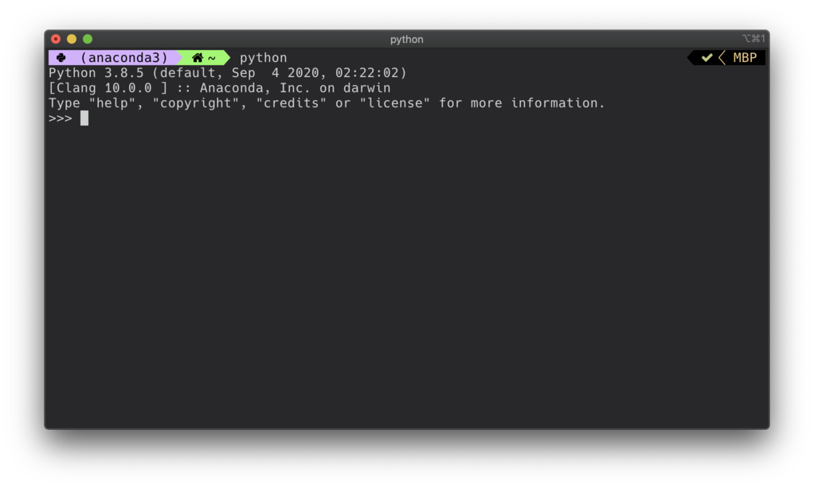

--

to get back to your prompt, type `exit()` or `quit()`

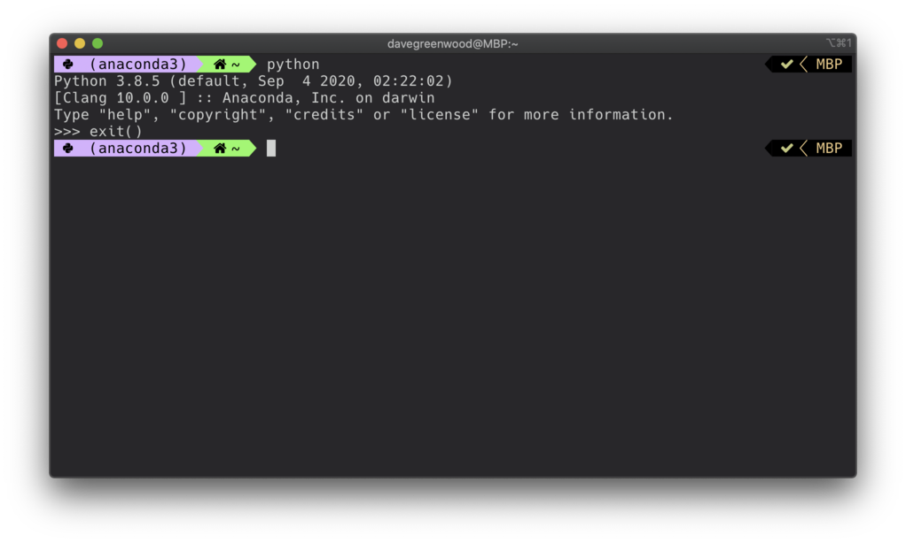

Note: you can also use the key press ctrl d or ctrl z

--

help is available in interactive mode...

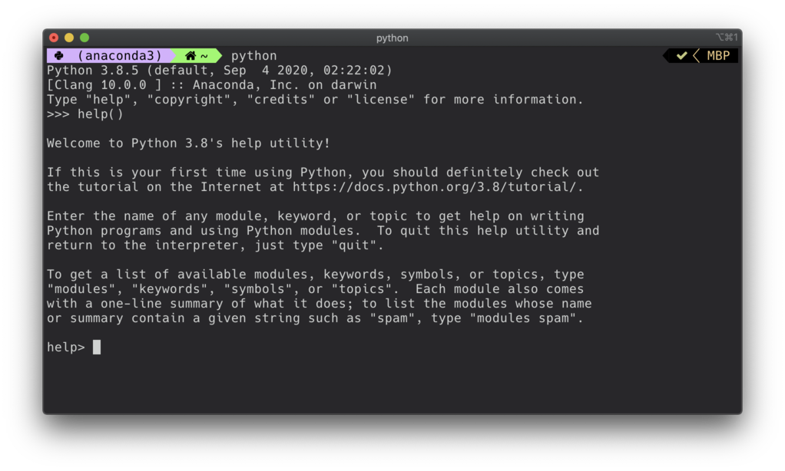

Note: To exit help, type q for "quit" and then hit the enter key. 
You will be taken back to the Python shell

--

you can type simple expressions...

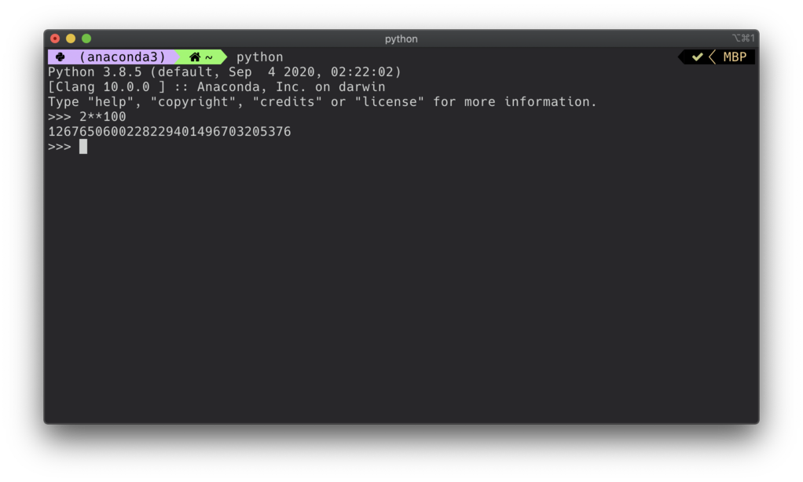

Note: check out the big integers in python!!Your calculator will not do this!!

--

secondary prompt for continuation lines...

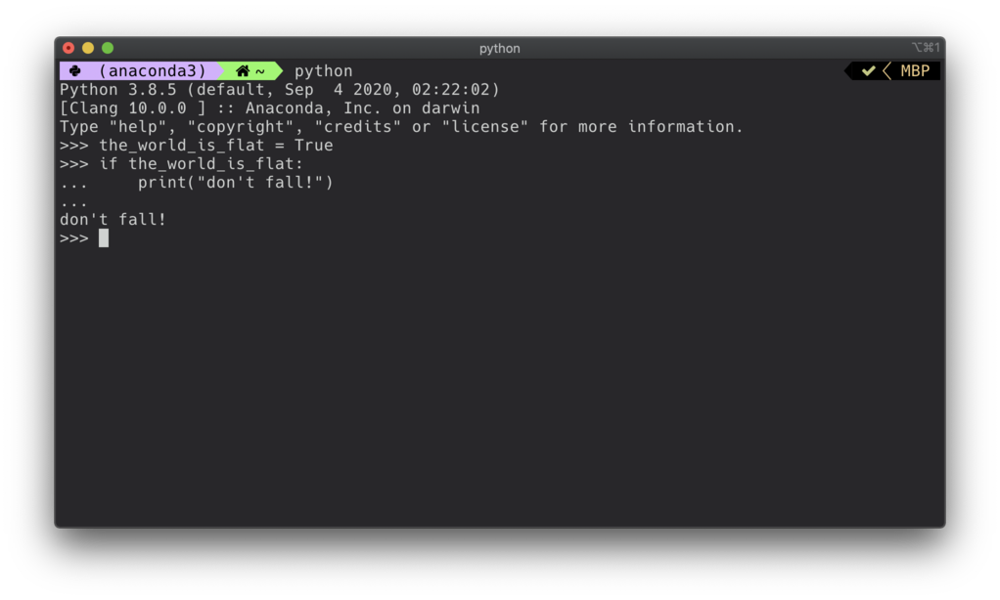

Note: you can use tab to indent, and return moves to next line...

---

# iPython

--

documents:

https://ipython.readthedocs.io/en/stable/

Note: I wont cover installing... but if you need help, ask!

--

The iPython shell is much more powerful,

and enables a number of advanced features.

--

in your shell, type `ipython`

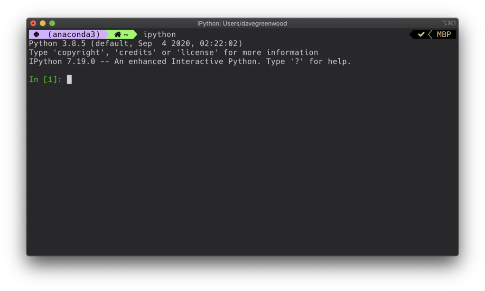

--

to get back to your prompt, type `CTRL-D` or `CTRL-Z`

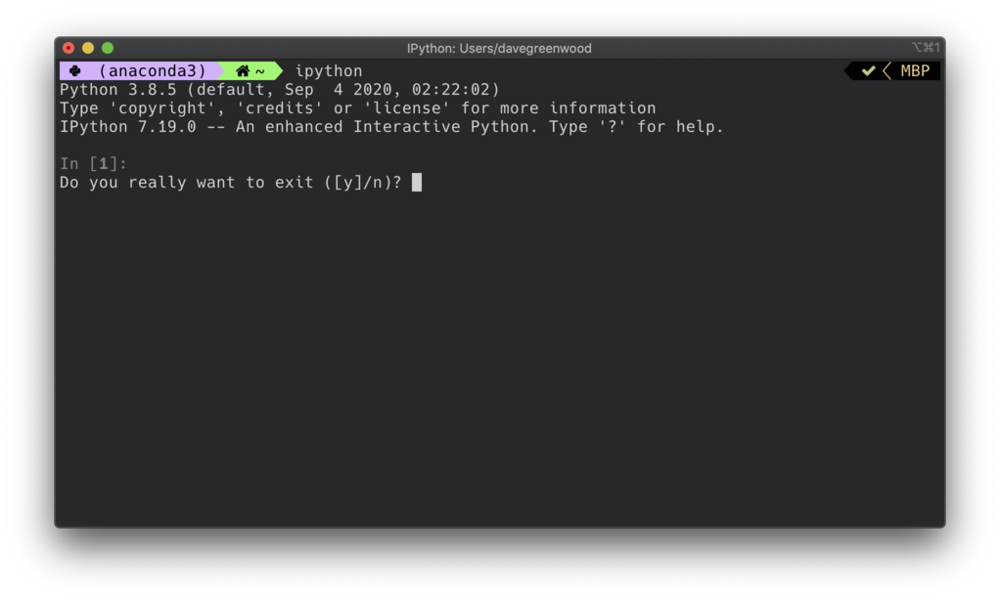


Note: you can also use the key press ctrl d or ctrl z
Typing an end-of-file character (Control-D on Unix, Control-Z on Windows)
also = to get back to your system prompt, type `exit()` or `quit()`

--

you can type simple expressions...

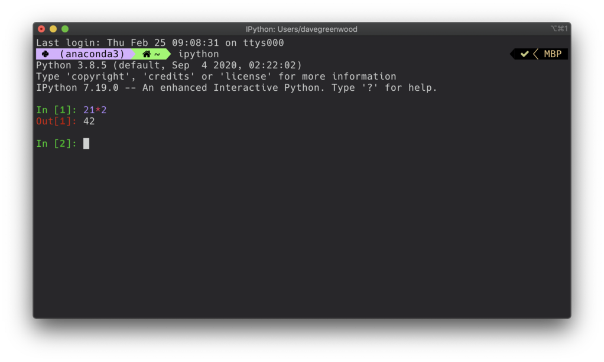

Note: the prompt is numbered...

--

we get syntax highlighting, and completions

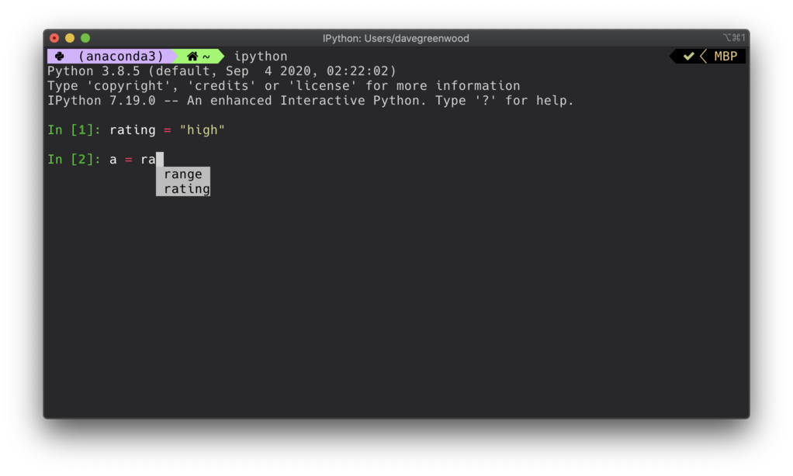

--

we also get tab completion, with object awareness...

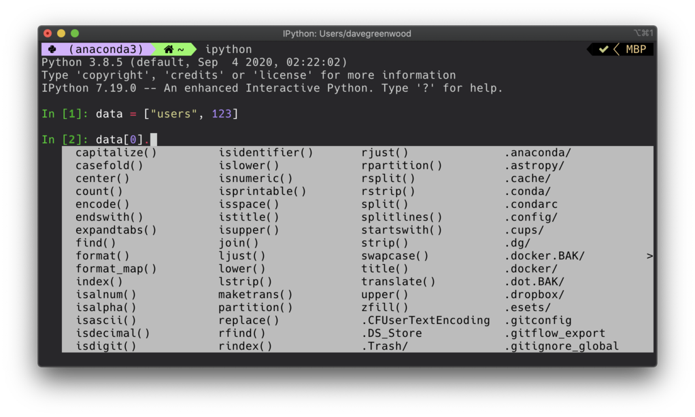

Note: here, the interpreter is aware data[0] is a string.

--

just like MATLAB, we have the `whos` command to see the workspace variables.

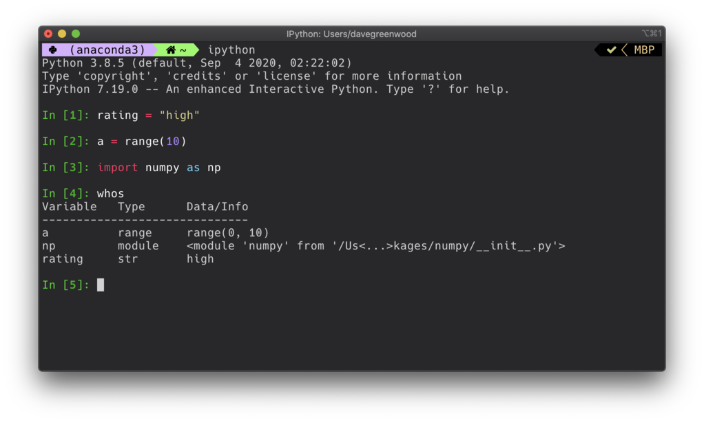

Note: here, the interpreter is aware data[0] is a string.

--

We can use any shell command by prefixing with `!`

For example, `!ls`, `!pwd`, and `!echo`

--

It's possible to capture output as a python object.

```python
In [1]: pwd = !pwd

In [2]: pwd
Out[3]: ['/Users/davegreenwood']

```

--

## `%magics`

IPython has a number of commands available specific to and provided by the kernel.

--

### `%edit`

We can launch a file editor and write some code

```python
In [17]: %edit
IPython will make a temporary file named: /var/folders/tmp.py
Editing... done. Executing edited code...
56088
Out[17]: 'a = 123\nb = 456\nx = a*b\nprint(x)\n\n'
```

--

### `%timeit`

```python
In [19]: %timeit sum(range(100))
1.03 µs ± 16.7 ns per loop (1000000 loops)
```

Note: timeit repeats the operation and reports the average

--

### `%matplotlib`

```python
In [1]: %matplotlib
Using matplotlib backend: MacOSX

In [2]: import numpy as np
In [3]: import matplotlib.pyplot as plt

In [4]: x = np.linspace(0, 2*np.pi, 1000)
In [5]: y = np.sin(x)

In [6]: plt.plot(x, y)
Out[7]: [<matplotlib.lines.Line2D at 0x7ffa481b65e0>]

```

--

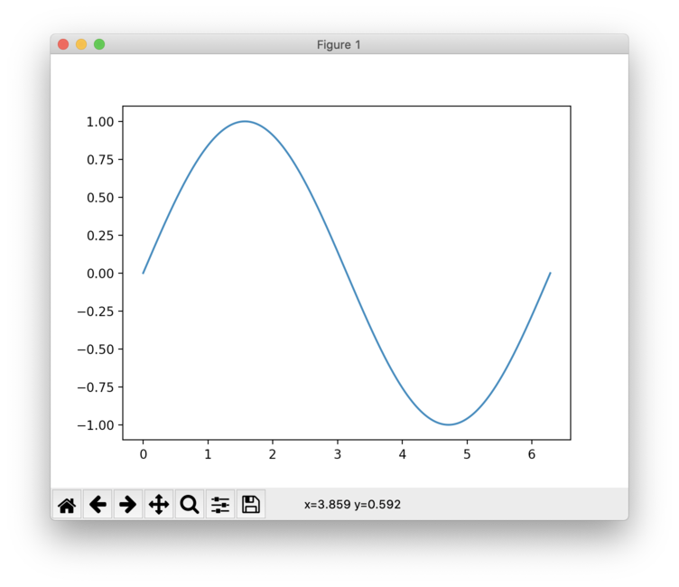

Note: Gives interactive plotting to the console, but 
I recommend the jupyter environment for this purpose.

---

# Jupyter

--

> The name Jupyter, is inspired by the programming languages **Ju**lia, **Py**thon and **R**.

> from an [article](https://www.nature.com/articles/d41586-018-07196-1) on nature.com

Note:
Jupyter is a free, open-source, interactive web tool known as a computational notebook. 
Named jupyter according to co-founder Fernando Pérez

--

Jupyter Notebooks consist of two parts:

1. User input, in the form of a file read by a browser.
2. A computational **kernel**, either *local* or *remote*.

Note: The file extension ipynb infers ipython notebook.
The file is in fact legitimate JSON, and can be parsed as such. 

--

## Widgets

You can use widgets to build interactive GUIs for your notebooks.
<!-- .element: class="fragment" -->

Note:

Widgets are eventful python objects that have a representation in the browser, 
often as a control like a slider, textbox, etc.

https://github.com/jupyter-widgets/ipywidgets/blob/master/docs/source/examples/Widget%20Basics.ipynb

--

## Types of Widget

Most basic types have a corresponding widget.

There are *password*, *html* and *image* widgets...
<!-- .element: class="fragment" -->

...and **many** others.
<!-- .element: class="fragment" -->

--

<!-- .slide: data-background-image="../assets/img/sortie.jpg" -->

# Example

--

## Interact

Interact allows us to pass values from widgets to python functions.

Note:

At the most basic level, interact autogenerates UI controls for function 
arguments, and then calls the function with those arguments when you 
manipulate the controls interactively. 
To use interact, you need to define a function that you want to explore.

--

<!-- .slide: data-background-image="../assets/img/exit.jpg" -->

# Example

--

### Jupyter project blog

https://blog.jupyter.org

---

# Questions

---

Slides and code are available on Teams

I have also made everything available on GitHub

https://github.com/uea-teaching/python-introduction

---
